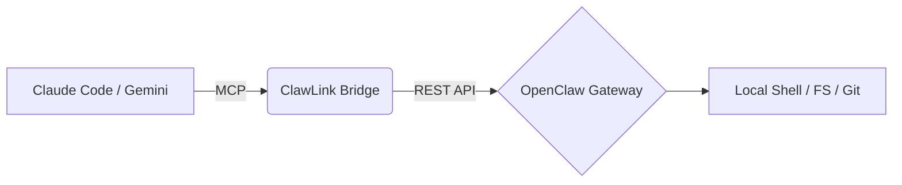

# 🦞 ClawLink: The "Hands" for AI Agents

**ClawLink** is a lightweight AICF (AI Coordination Framework) bridge that connects high-level AI "Brains" (Claude Code, Gemini, etc.) with local execution environments via **OpenClaw**.

## 🧠 Philosophy: Brain + Hands
Most AI agents live in sandboxed or cloud-based environments. They are smart ("Brain") but lack physical reach to your local system ("Hands"). ClawLink solves this by acting as a **Privileged Tactical Proxy**:

1. **The Brain (AI)** thinks and plans the engineering logic.
2. **The Bridge (ClawLink)** translates AI intent into local protocols (MCP/REST).
3. **The Hands (OpenClaw)** executes the actual commands on your machine within safe boundaries.

## ✨ Key Features
- **MCP Adapter**: Seamlessly integrates as a skill in Claude Code, Cursor, and IDEs.
- **REST Delegation**: Forwards execution tasks to the [OpenClaw](https://github.com/dgy-github/openclaw) Gateway API.
- **Security First**: No direct shell spawning; leverages OpenClaw's security policy and sandbox.
- **Auto-Discovery**: Automatically finds local OpenClaw configuration and credentials.
- **GitHub Sync**: Dedicated tools for atomic Git operations via local SSH keys.

## 🛠️ Installation (Claude Code)

Install ClawLink as a global MCP skill with one command:

```bash
claude mcp add clawlink -- node C:/Users/Administrator/.openclaw/workspace/clawlink/dist/index.js
```

## 🚀 Usage Examples

Once installed, you can command your AI agent to use ClawLink for local tasks:

**Terminal Execution:**
> "ClawLink, help me run `npm test` in the current directory."

**System Health:**
> "ClawLink, what is the status of my local OpenClaw gateway?"

**File Operations:**
> "ClawLink, read the content of `package.json` and tell me the version."

## 🏗️ Architecture


## 🔧 Configuration
ClawLink automatically reads `~/.openclaw/openclaw.json` to determine:
- **Port:** Default `18789`.
- **Auth:** Gateway Token (auto-fetched).

## 📄 License
MIT
